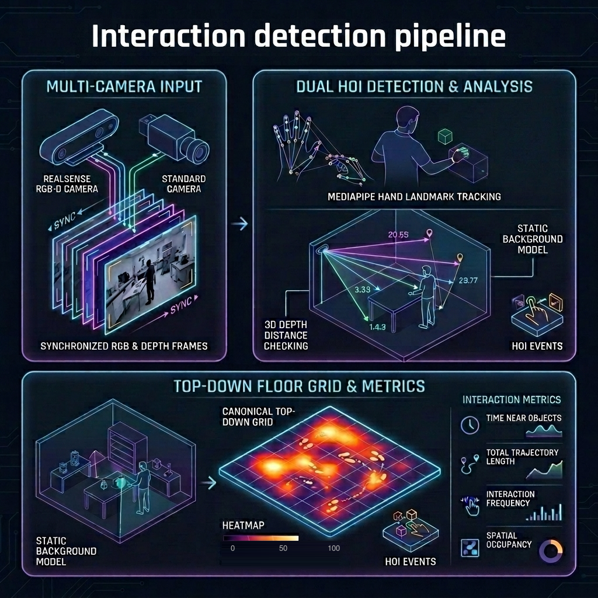
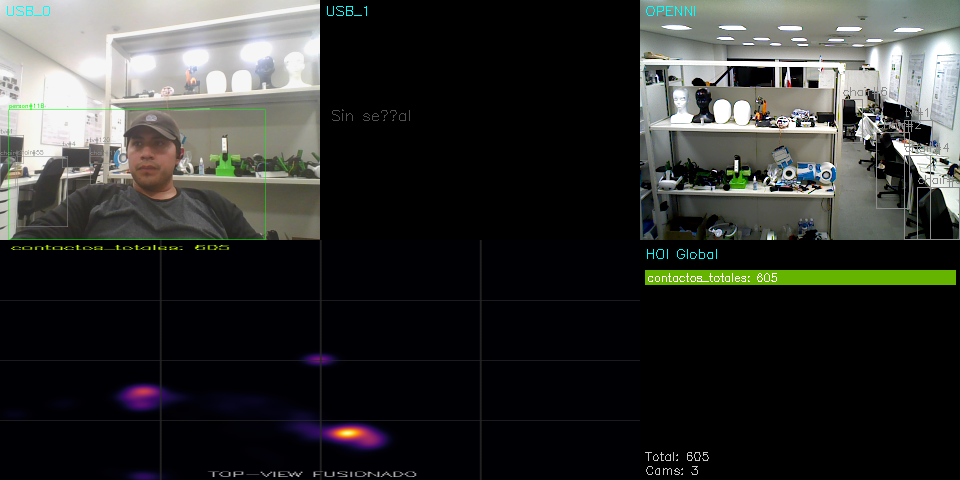

# MIRAI — Multi-Camera Human-Object Interaction Analysis

<p align="center">
  
</p>

Sistema de detección y análisis de interacciones humano-objeto (HOI) en tiempo real con soporte multicámara. Combina una cámara RealSense RGB-D (con profundidad) y cámaras USB estándar para generar un mapa de calor top-down del espacio de trabajo.

---

## Características

- **Detección de personas y objetos** con YOLO (tracking multi-frame con IDs persistentes)
- **Tracking de manos** con MediaPipe Hand Landmarker
- **Detección de contacto** por tres métodos en cascada:
  - Depth + mapa de background calibrado (más preciso)
  - Depth sin mapa base (durante warm-up de calibración)
  - Cinemático RGB (fallback sin depth)
- **Mapa de calor top-down** acumulativo con decay temporal
- **Modo online**: procesamiento en tiempo real con visualización
- **Modo offline**: grabación primero, postprocesamiento después con soporte para integrar múltiples sesiones en un solo mapa

---

## Dependencias

```bash
pip install opencv-python ultralytics mediapipe pyrealsense2 pyyaml tqdm torch
```

| Paquete | Uso |
|---|---|
| `opencv-python` | Captura, VideoWriter, visualización |
| `ultralytics` | YOLO — detección y tracking |
| `mediapipe` | Hand Landmarker |
| `pyrealsense2` | SDK Intel RealSense |
| `pyyaml` | Lectura/escritura de metadata |
| `tqdm` | Barra de progreso en postprocesamiento |
| `torch` | Backend GPU para YOLO |

**Modelos requeridos** (en el directorio raíz):
- `yolo26x.pt` — modelo YOLO de detección
- `hand_landmarker.task` — modelo MediaPipe

---

## Estructura del Proyecto

```
mirai/
├── launchcameras.py          # Visualización simple (sin HOI)
├── launchhoi.py              # Sistema completo online (HOI en vivo)
├── record.py                 # Grabación multicámara a disco
├── postprocess.py            # Postprocesamiento offline
│
├── camerathread/
│   ├── basecamera.py         # Interfaz base de cámara
│   ├── camerathread.py       # Hilo de captura genérico
│   ├── realsensecamera.py    # Intel RealSense D-series
│   ├── usbcamera.py          # Cámara USB estándar
│   ├── filecamera.py         # Lector de sesiones grabadas
│   ├── displaythread.py      # Hilo de visualización
│   └── utils.py              # Detección automática de dispositivos
│
└── hoithread/
    ├── environmentbuild.py   # Construcción automática del mapa de fondo
    ├── inference.py          # InferenceThread (modo online)
    ├── inference_processor.py# InferenceProcessor (modo offline)
    └── fusion.py             # Acumulación del heatmap y mosaico
```

---

## Modos de Uso

### Modo Online — HOI en tiempo real

Detecta y visualiza interacciones en vivo. Las cámaras se detectan automáticamente.

```bash
python launchhoi.py
```

El sistema arranca en modo **calibración** (barra naranja en pantalla) durante los primeros ~60 frames sin personas en escena para construir el mapa de background. Una vez calibrado, la detección de contacto por depth se activa automáticamente.

**Controles:**
- `ESC` — cerrar ventanas y salir

---

### Modo Offline — Grabación + Postprocesamiento

Útil para analizar sesiones largas, repetir el análisis con distintos parámetros o integrar varias sesiones en un solo mapa.

#### Paso 1: Grabar

```bash
# Grabar todas las cámaras detectadas
python record.py

# Con preview en tiempo real
python record.py --preview

# Solo cámara RealSense (ignorar webcams USB)
python record.py --no-usb

# Cambiar directorio de salida
python record.py --dir mis_grabaciones
```

Cada ejecución crea una carpeta nueva con timestamp:

```
recordings/session_20260608_170000/
├── metadata.yaml               # Configuración de la sesión
├── cam_RS_<serial>/
│   ├── color.mp4               # Video RGB (H.264 o mp4v)
│   ├── timestamps.csv          # timestamp_ns por frame
│   └── depth/
│       └── <timestamp_ns>.png  # Mapas de profundidad uint16 (mm)
└── cam_USB_<idx>/
    ├── color.mp4
    └── timestamps.csv
```

#### Paso 2: Postprocesar

```bash
# Una sesión
python postprocess.py recordings/session_20260608_170000 --out output/sesion1

# Con preview mientras procesa
python postprocess.py recordings/session_20260608_170000 --preview

# Múltiples sesiones → un solo mapa integrado
python postprocess.py recordings/session_A recordings/session_B --out output/integrado
```

Si el proceso se interrumpe (Ctrl+C), se puede reanudar ejecutando exactamente el mismo comando — el script continúa desde el último frame guardado.

**Salida:**

```
output/
├── output_mosaic.mp4   # Video completo: cámaras anotadas + heatmap top-down
├── hoi_stats.json      # Conteo acumulado de interacciones
└── hoi_heatmap.png     # Imagen final del mapa de calor
```

---

## Sincronización Multicámara

La sincronización entre cámaras se realiza por **timestamp** (no por índice de frame). Cada cámara graba su propio `timestamps.csv` con el instante de captura en nanosegundos. Esto garantiza que frames descartados por saturación de bus USB o carga de CPU no desfasen el stream de profundidad respecto al video de color.

---

## Mapa de Calor

El mapa top-down acumula la presencia de contactos mano-objeto proyectados al plano canónico (400×400 px). El decay es temporal — se calcula a partir del tiempo real entre frames (`timestamps.csv`), lo que garantiza que el comportamiento del mapa es idéntico entre el modo online y el offline independientemente de la velocidad de procesamiento.

<p align="center">
  
</p>

---

## Notas

- El warm-up de calibración requiere que la escena esté **vacía** (sin personas) durante ~2 segundos al inicio. Si hay personas desde el primer frame, el buffer se reinicia hasta encontrar una ventana libre.
- En postprocesamiento, si se dispone del mapa de background guardado (`background/`), el warm-up se omite completamente.
- El tracker de YOLO reinicia sus IDs entre sesiones en el modo multi-sesión — esto es intencional para evitar colisiones de ID entre grabaciones distintas.
- La homografía de cada cámara al plano canónico puede registrarse con `fusion.set_homography(cam_id, H)` para corrección de perspectiva. Sin calibración, la proyección usa escalado directo.
